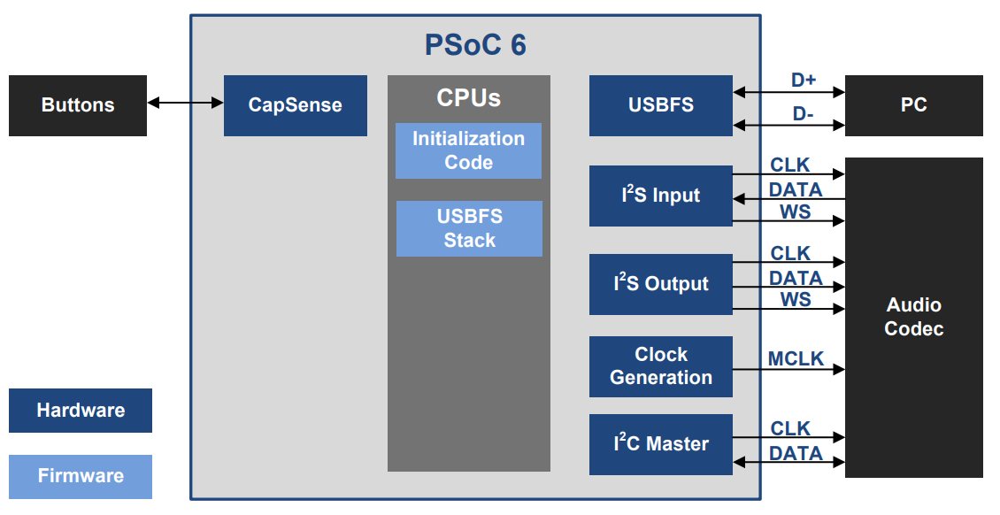
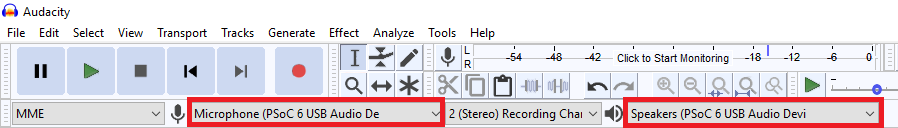
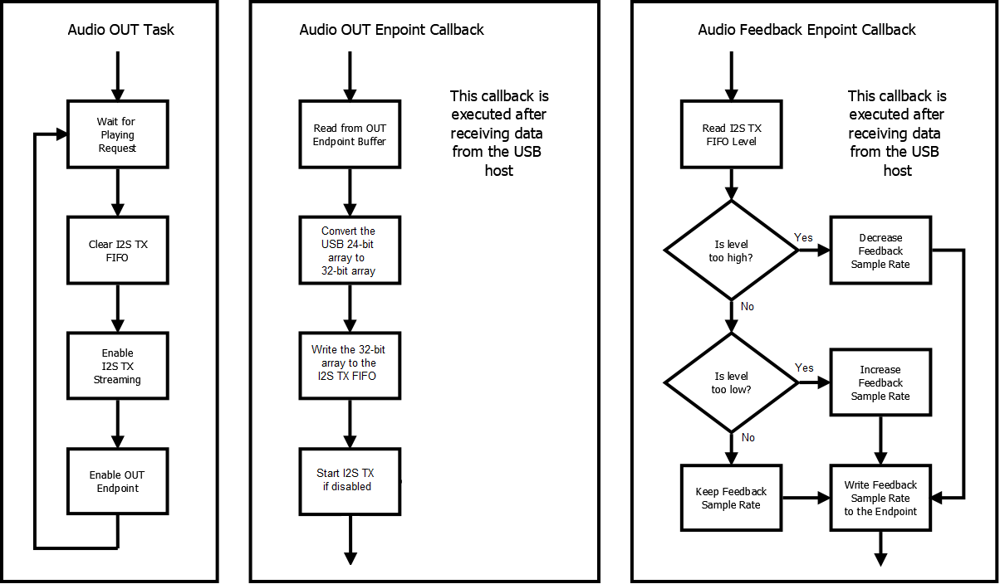
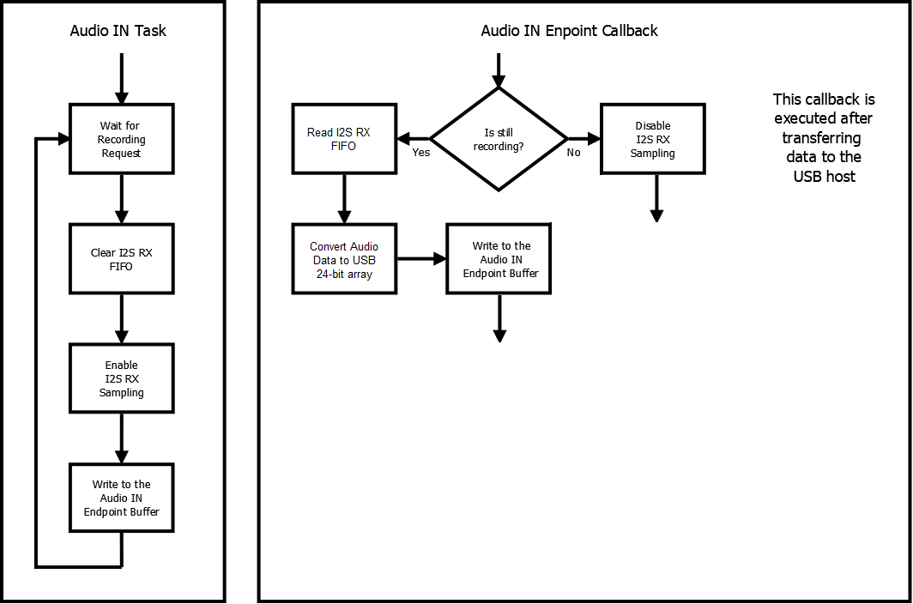

# PSoC 6 MCU: USB Audio Device (FreeRTOS)

This example demonstrates how to use PSoC® 6 MCU to implement a USB audio device and HID audio playback control that connects to the PC via the USB interface. The example uses FreeRTOS.

## Overview

This code example shows how to use the PSoC 6 MCU to enumerate a standard USB Audio Device and HID Consumer Control over the USB interface. The PC host sees the device as:
- Audio Playback device
- Microphone/Recording device
- Remote Control handling volume, play/pause/stop

The PSoC 6 MCU device works as a bridge between the audio data streamed from the USB host and the I2S block, which connects to an audio codec. The audio codec outputs the audio data to a speaker or headphone. The same audio codec can input microphone data and stream to the PSoC 6 MCU device, which bridges to the USB interface.

CapSense® buttons are used to play/pause/stop and change the volume of the data streamed to the PSoC 6 MCU device. Any press on CapSense buttons are reported back to the host over USB HID Consumer Control.

**Figure 1. Block Diagram**



[Provide feedback on this Code Example.](https://cypress.co1.qualtrics.com/jfe/form/SV_1NTns53sK2yiljn?Q_EED=eyJVbmlxdWUgRG9jIElkIjoiQ0UyMjQ5OTciLCJTcGVjIE51bWJlciI6IjAwMi0yNDk5NyIsIkRvYyBUaXRsZSI6IlBTb0MgNiBNQ1U6IFVTQiBBdWRpbyBEZXZpY2UgKEZyZWVSVE9TKSIsInJpZCI6InJsb3MiLCJEb2MgdmVyc2lvbiI6IjIuMC4wIiwiRG9jIExhbmd1YWdlIjoiRW5nbGlzaCIsIkRvYyBEaXZpc2lvbiI6Ik1DRCIsIkRvYyBCVSI6IklDVyIsIkRvYyBGYW1pbHkiOiJQU09DIn0=)

## Requirements

- [ModusToolbox® software](https://www.cypress.com/products/modustoolbox-software-environment) v2.2 
    
    **Note:** This code example version requires ModusToolbox software version 2.2 or later and is not backward compatible with v2.1 or older versions. If you can't move to ModusToolbox v2.2, please use the latest compatible version of this example: [latest-v1.X](https://github.com/cypresssemiconductorco/mtb-example-psoc6-usb-audio-device-freertos/tree/latest-v1.X).  
- Board Support Package (BSP) minimum required version: 2.0.0  
- Programming Language: C
- Associated Parts: All [PSoC 6 MCU](http://www.cypress.com/PSoC6) parts with USB

## Supported Toolchains (make variable 'TOOLCHAIN')

- GNU Arm® Embedded Compiler v9.3.1 (GCC_ARM) - Default value of `TOOLCHAIN`
- Arm compiler v6.11 (ARM)
- IAR C/C++ compiler v8.42.2 (IAR)

## Supported Kits (make variable 'TARGET')

- [PSoC 6 Wi-Fi BT Prototyping Kit](https://www.cypress.com/CY8CPROTO-062-4343W) (CY8CPROTO-062-4343W) - Default target
- [PSoC 6 WiFi-BT Pioneer Kit](https://www.cypress.com/CY8CKIT-062-WiFi-BT) (CY8CKIT-062-WIFI-BT)
- [PSoC 62S2 Wi-Fi BT Pioneer Kit](https://www.cypress.com/CY8CKIT-062S2-43012) (CY8CKIT-062S2-43012)
- [PSoC 62S1 Wi-Fi BT Pioneer Kit](https://www.cypress.com/CYW9P62S1-43438EVB-01) (CYW9P62S1-43438EVB-01)
- [PSoC 62S1 Wi-Fi BT Pioneer Kit](https://www.cypress.com/CYW9P62S1-43012EVB-01) (CYW9P62S1-43012EVB-01)
- [PSoC 64 Secure Boot Wi-Fi BT Pioneer Kit](https://www.cypress.com/CY8CKIT-064B0S2-4343W) (CY8CKIT-064B0S2-4343W)

## Hardware Setup

You must connect the CY8CKIT-028-TFT shield to the Arduino header if you are using any of the pioneer kits. You need a third-party module - [Pmod I2S2: Stereo Audio Input and Output](https://store.digilentinc.com/pmod-i2s2-stereo-audio-input-and-output/) if you are using the CY8CPROTO-062-4343W kit. You need to solder this module to the Pmod header J15 on the kit.

**Note:** The PSoC 6 BLE Pioneer Kit (CY8CKIT-062-BLE) and the PSoC 6 WiFi-BT Pioneer Kit (CY8CKIT-062-WIFI-BT) ship with KitProg2 installed. ModusToolbox software requires KitProg3. Before using this code example, make sure that the board is upgraded to KitProg3. The tool and instructions are available in the [Firmware Loader](https://github.com/cypresssemiconductorco/Firmware-loader) GitHub repository. If you do not upgrade, you will see an error like "unable to find CMSIS-DAP device" or "KitProg firmware is out of date".

## Software Setup

This example uses the [Audacity](https://www.audacityteam.org/) tool to record and play sound. You can also use any software tool that plays music.

## Using the Code Example

### In Eclipse IDE for ModusToolbox:

1. Click the **New Application** link in the Quick Panel (or, use **File** > **New** > **ModusToolbox Application**).

2. Pick a kit supported by the code example from the list shown in the **Project Creator - Choose Board Support Package (BSP)** dialog.

   When you select a supported kit, the example is reconfigured automatically to work with the kit. To work with a different supported kit later, use the [Library Manager](https://www.cypress.com/ModusToolboxLibraryManager) to choose the BSP for the supported kit. You can use the Library Manager to select or update the BSP and firmware libraries used in this application. To access the Library Manager, click on the link from the Quick Panel. 

   You can also just start the application creation process again and select a different kit.

   If you want to use the application for a kit not listed here, you may need to update the source files. If the kit does not have the required resources, the application may not work.

3. In the **Project Creator - Select Application** dialog, choose the example by enabling the checkbox.

4. Optionally, change the suggested **New Application Name**.

5. Enter the local path in the **Application(s) Root Path** field to indicate where the application needs to be created. 

   Applications that can share libraries can be placed in the same root path.

6. Click **Create** to complete the application creation process.

For more details, see the [Eclipse IDE for ModusToolbox User Guide](https://www.cypress.com/MTBEclipseIDEUserGuide) (locally available at *{ModusToolbox install directory}/ide_{version}/docs/mt_ide_user_guide.pdf*).

### In Command-line Interface (CLI):

1. Download and unzip this repository onto your local machine, or clone the repository.

2. Open a CLI terminal and navigate to the application folder.

   On Linux and macOS, you can use any terminal application. On Windows, navigate to the modus-shell directory (*{ModusToolbox install directory}/tools_\<version>/modus-shell*) and run *Cygwin.bat*.

   **Note:** Ensure that the *deps* folder contains the required BSP file (*TARGET_xxx.mtb*) corresponding to the TARGET. Use the Library Manager (`make modlibs` command) to select and download the BSP file. If the selected kit does not have the required resources or is not [supported](#supported-kits-make-variable-target), the application may not work. 

3. Import the required libraries by executing the `make getlibs` command.

### In Third-party IDEs:

1. Follow the instructions from the CLI section to download or clone the repository, and import the libraries using the `make getlibs` command.

2. Export the application to a supported IDE using the `make <ide>` command.

3. Follow the instructions displayed in the terminal to create or import the application as an IDE project.

For more details, see the "Exporting to IDEs" section of the [ModusToolbox User Guide](https://www.cypress.com/ModusToolboxUserGuide) (locally available at *{ModusToolbox install directory}/docs_{version}/mtb_user_guide.pdf*.

## Operation

If using a PSoC 64 Secure MCU kit (like CY8CKIT-064B0S2-4343W), the PSoC 64 Secure MCU must be provisioned with keys and policies before being programmed. Follow the instructions in the [Secure Boot SDK User Guide](https://www.cypress.com/documentation/software-and-drivers/psoc-64-secure-mcu-secure-boot-sdk-user-guide) to provision the device. If the kit is already provisioned, copy-paste the keys and policy folder to the application folder.

1. Connect the CY8CKIT-028-TFT shield to the Pioneer Kit, or connect Pmod I2S2 to the CY8CPROTO-062-4343W kit.

2. Connect the board to your PC using the provided USB cable through the KitProg USB connector.

3. Program the board.

   - **Using Eclipse IDE for ModusToolbox:**

      1. Select the application project in the Project Explorer.

      2. In the **Quick Panel**, scroll down, and click **\<Application Name> Program (KitProg3)**.

   - **Using CLI:**

     From the terminal, execute the `make program` command to build and program the application using the default toolchain to the default target. You can specify a target and toolchain manually:
      ```
      make program TARGET=<BSP> TOOLCHAIN=<toolchain>
      ```

      Example:
        ```
        make program TARGET=CY8CPROTO-062-4343W TOOLCHAIN=GCC_ARM
        ```
        
        **Note:** Before building the application, ensure that the *deps* folder contains the BSP file (*TARGET_xxx.mtb*) corresponding to the TARGET. Execute the `make getlibs` command to fetch the BSP contents before building the application.  

       After programming, the application starts automatically. 

4. Connect a headphone or earphone to the audio jack of the CY8CKIT-028-TFT shield, or to the Pmod I2S2 audio jack.

5. Connect another USB cable from your PC (or reuse the same cable used to program the kit) to the USB device connector (see the kit user guide for its location). 

6. On the computer, verify that a new USB device was enumerated as a Speaker/Microphone and named as "PSoC 6 USB Audio Device".

7. Use your audio software to specify the microphone or speaker. In the Audacity software tool, select the microphone and speaker name as "PSoC 6 USB Audio Device".

   

8. Record some sound. In Audacity, press **Record** . Stop at any time by pressing **Stop** .

9. Play the record by pressing **Play**  and confirm that the sound was recorded correctly.

10. Open a music player in the PC and start playing a song. Use the CapSense slider to change the volume.

    **Note:** You might need to set the Speaker "PSoC 6 USB Audio Device" as the default speaker device in your OS.

11. Press the left CapSense button (BTN0) in the kit to play/pause a sound track.

12. Press the right CapSense button (BTN1) in the kit to stop a sound track.

## Debugging

You can debug the example to step through the code. In the IDE, use the **\<Application Name> Debug (KitProg3_MiniProg4)** configuration in the **Quick Panel**. For more details, see the "Program and Debug" section in the [Eclipse IDE for ModusToolbox User Guide](https://www.cypress.com/MTBEclipseIDEUserGuide).

**Note:** **(Only while debugging)** On the CM4 CPU, some code in `main()` may execute before the debugger halts at the beginning of `main()`. This means that some code executes twice - before the debugger stops execution, and again after the debugger resets the program counter to the beginning of `main()`. See [KBA231071](https://community.cypress.com/docs/DOC-21143) to learn about this and for the workaround.

## Design and Implementation

The [CY8CKIT-028-TFT](https://www.cypress.com/documentation/development-kitsboards/tft-display-shield-board-cy8ckit-028-tft) shield contains the audio codec [AK4954A](https://www.akm.com/content/dam/documents/products/audio/audio-codec/ak4954aen/ak4954aen-en-datasheet.pdf), which is a 32-bit stereo codec with microphone. The [PMod I2S2](https://store.digilentinc.com/pmod-i2s2-stereo-audio-input-and-output/) module contains the [Cirrus CS5343](https://www.cirrus.com/products/cs5343-44/?_ga=2.191300067.810289828.1576048380-104852753.1571286442) and [Cirrus CS4344](https://www.cirrus.com/products/cs4344-45-48/?_ga=2.191300067.810289828.1576048380-104852753.1571286442) converters. 

If using AK4594A, the PSoC 6 MCU device configures the audio codec through the I2C Master (SCB) and streams the audio data through the I2S interface, which operates as Master (Tx) and Slave (Rx). 

If using Pmod I2S2, you do not need to configure it over I2C; the I2S interface operates as Master only (Tx and Rx). The codecs also require a Master clock (MCLK), which is generated by the PSoC 6 MCU device using a PWM (TCPWM). This clock is set to be 384x the frame rate. In this application, the frame rate can be set to 48 ksps and 44.1 ksps, requiring MCLK of 18.432 MHz and 16.9344 MHz, respectively.

Note that the recommended method to generate the MCLK is through the HFCLK4, which allows connecting directly to an external pin. In this case, the PLL can source the HFCLK1 (audio subsystem) and HFCLK4, and any other available clock can drive the HFCLK0 (system clock).

### Firmware Details

The firmware implements a bridge between the USB and I2S blocks. The USB descriptor implements the Audio Device Class with four endpoints and the HID Device Class with one endpoint:

- **Audio Control Endpoint:** Controls the access to the audio streams
- **Audio IN Endpoint:** Sends the audio data to the USB host
- **Audio OUT Endpoint:** Receives the audio data from the USB host
- **Audio Feedback Endpoint:** Controls the sample rate in the OUT endpoint
- **HID Audio/Playback Control Endpoint:** Controls the volume and audio stream

The USB buffers store interleaved 24-bit audio stereo data. However, the I2S FIFO requires 32-bit accesses, even if you configured the FIFO word length to be 24-bit. To handle this disparity, the Audio OUT endpoint handler converts the USB 24-bit array to a 32-bit array, and then writes the 32-bit array to the I2S Tx FIFO. The Audio IN endpoint handler reads the 32-bit data from the I2S Rx FIFO, and then converts the 32-bit array to a 24-bit array. 

The example project firmware uses FreeRTOS on the CM4 CPU. The following tasks are created in *main.c*:

- **Audio App Task:** Implements the high-level functions related to the audio. For example, requests to change the sample rate and volume.

- **Audio IN Task:** Implements the functions related to the Audio IN Endpoint.

- **Audio OUT Task:** Implements the functions related to the Audio OUT Endpoint.

- **Touch Task:** Implements the user interface related to CapSense.

- **Idle Task:** Goes to sleep.

The example also uses the FreeRTOS Event Group, which notifies tasks when USB events occur.

**Figure 2. Audio OUT and Feedback Endpoints Flow**




**Figure 3. Audio IN Endpoint Flow**



The Audio IN task waits for a recording request from the USB host. When it receives the request, it prepares I2S Rx to sample a new frame. It initially writes a null frame to the Audio IN Endpoint buffer to initiate the recording. The frame size depends on the sample rate (48 ksps or 44.1 ksps), the number of channels (2x), and the duration of USB transfer (1 ms). The overall equation is:

```
Frame size = Sample Rate x Number of Channels x Transfer Time
```

In this example, the frame size is equal to 48000 x 2 x 0.001 = 96 samples. Note that the Audio IN Endpoint Callback reads all the data available in the I2S Rx FIFO. In ideal conditions, it would read 96 samples, but it might read more or less samples, depending on the clock differences between the PSoC 6 MCU Audio Subsystem clock and the Host USB clock. 

There is also a mechanism to synchronize the clocks between USB host and the PSoC 6 MCU audio subsystem in the OUT endpoint flow. It uses the Feedback Endpoint callback to report back to the USB host how fast I2S Tx streams the data, so that the host can increase or decrease the sample rate.

In the Touch task, the firmware uses the CapSense resource to scan finger touches on the kit's buttons and slider. The left button (BTN0) plays or pauses a sound track, and the right button (BTN1) stops a sound track. This is achieved by sending a command over the HID Audio/Playback Control endpoint. The CapSense slider controls the volume. It also sends a command over the HID and configures the volume played in the audio codec.

**Table 1. Project Files**

File  | Description
------|-------
*main.c (CM4)* | Contains the main function, which is the entry point for executing the application. The main function sets up user tasks and starts the RTOS scheduler. It also implements the Idle task.
*audio_app.c/h* |Contain the task that handle the audio-related blocks, such as the USB Audio events and I2S control.
*audio_in.c/h* | Contain the task that handles recording requests to the Audio IN endpoint. These files also implement the Audio IN Data Endpoint callback.
*audio_out.c/h* | Contain the task that handles playing requests to the Audio OUT endpoint. These files also implement the Audio OUT Data Endpoint callback.
*audio.h* | Contains macros related to the USBFS descriptor.
*usb_comm.c/h* | Contain macros and functions related to the USBFS block and USB Audio Device class.
*audio_feed.c/h* |Implement the Audio Feedback Endpoint callback.
*touch.c/h* |Handle CapSense calls.
*ak4954a.c/h* |Implement the driver for the AK4954A audio codec.
*rtos.h* |Contains macros and handles for the FreeRTOS components in the application.
*FreeRTOSConfig.h* |Contains the FreeRTOS settings and configuration. Non-default setting are marked with inline comments. For details of FreeRTOS configuration options, see the [FreeRTOS customization](https://www.freertos.org/a00110.html) webpage.

### Resources and Settings

**Table 2. Application Resources**

| Resource  |  Alias/Object     |    Purpose     |
| :------- | :------------    | :------------ |
| SCB (I2C) (HAL) | mi2c          | I2C Master Driver to configure the audio codec |
| TCPWM (PWM) (HAL)| mclk_pwm | PWM to clock the external audio codec |
| USBDEV (PDL)   | CYBSP_USBDEV         | USB Device configured with Audio and HID Descriptors  |
| I2S (HAL)    | CYBSP_I2S | Interface with the audio codec |
| CapSense (PDL) | CYBSP_CSD | Scan for button and slider touches |

## Related Resources

| Application Notes                                            |                                                              |
| :----------------------------------------------------------- | :----------------------------------------------------------- |
| [AN228571](https://www.cypress.com/AN228571) – Getting Started with PSoC 6 MCU on ModusToolbox | Describes PSoC 6 MCU devices and how to build your first application with ModusToolbox |
| [AN221774](https://www.cypress.com/AN221774) – Getting Started with PSoC 6 MCU on PSoC Creator | Describes PSoC 6 MCU devices and how to build your first application with PSoC Creator |
| [AN210781](https://www.cypress.com/AN210781) – Getting Started with PSoC 6 MCU with Bluetooth Low Energy (BLE) Connectivity on PSoC Creator | Describes PSoC 6 MCU with BLE Connectivity devices and how to build your first application with PSoC Creator |
| [AN215656](https://www.cypress.com/AN215656) – PSoC 6 MCU: Dual-CPU System Design | Describes the dual-CPU architecture in PSoC 6 MCU, and shows how to build a simple dual-CPU design |
| **Code Examples**                                            |                                                              |
| [Using ModusToolbox](https://github.com/cypresssemiconductorco/Code-Examples-for-ModusToolbox-Software) | [Using PSoC Creator](https://www.cypress.com/documentation/code-examples/psoc-6-mcu-code-examples) |
| **Device Documentation**                                     |                                                              |
| [PSoC 6 MCU Datasheets](https://www.cypress.com/search/all?f[0]=meta_type%3Atechnical_documents&f[1]=resource_meta_type%3A575&f[2]=field_related_products%3A114026) | [PSoC 6 Technical Reference Manuals](https://www.cypress.com/search/all/PSoC%206%20Technical%20Reference%20Manual?f[0]=meta_type%3Atechnical_documents&f[1]=resource_meta_type%3A583) |
| **Development Kits**                                         | Buy at www.cypress.com                                       |
| [CY8CKIT-062-BLE](https://www.cypress.com/CY8CKIT-062-BLE) PSoC 6 BLE Pioneer Kit | [CY8CKIT-062-WiFi-BT](https://www.cypress.com/CY8CKIT-062-WiFi-BT) PSoC 6 WiFi-BT Pioneer Kit |
| [CY8CPROTO-063-BLE](https://www.cypress.com/CY8CPROTO-063-BLE) PSoC 6 BLE Prototyping Kit | [CY8CPROTO-062-4343W](https://www.cypress.com/CY8CPROTO-062-4343W) PSoC 6 Wi-Fi BT Prototyping Kit |
| [CY8CKIT-062S2-43012](https://www.cypress.com/CY8CKIT-062S2-43012) PSoC 62S2 Wi-Fi BT Pioneer Kit | [CY8CPROTO-062S3-4343W](https://www.cypress.com/CY8CPROTO-062S3-4343W) PSoC 62S3 Wi-Fi BT Prototyping Kit |
| [CYW9P62S1-43438EVB-01](https://www.cypress.com/CYW9P62S1-43438EVB-01) PSoC 62S1 Wi-Fi BT Pioneer Kit | [CYW9P62S1-43012EVB-01](https://www.cypress.com/CYW9P62S1-43012EVB-01) PSoC 62S1 Wi-Fi BT Pioneer Kit|            
| [CY8CKIT-064B0S2-4343W](http://www.cypress.com/CY8CKIT-064B0S2-4343W) PSoC 64 Secure Boot Wi-Fi BT Pioneer Kit| [CY8CKIT-064B0S-4343W](https://www.cypress.com/CY8CKIT-064B0S2-4343W) PSoC 64 Wi-Fi BT Pioneer Kit
|                                                              |
| **Libraries**                                                 |                                                              |
| PSoC 6 Peripheral Driver Library (PDL) and docs                    | [psoc6pdl](https://github.com/cypresssemiconductorco/psoc6pdl) on GitHub |
| Cypress Hardware Abstraction Layer (HAL) Library and docs          | [psoc6hal](https://github.com/cypresssemiconductorco/psoc6hal) on GitHub |
| RetargetIO - A utility library to retarget the standard input/output (STDIO) messages to a UART port | [retarget-io](https://github.com/cypresssemiconductorco/retarget-io) on GitHub |
| **Middleware**                                               |                                                              |
| CapSense library and docs                                    | [capsense](https://github.com/cypresssemiconductorco/capsense) on GitHub |
| USB Device library and docs                                    | [usbdev](https://github.com/cypresssemiconductorco/usbdev) on GitHub |
| Links to all PSoC 6 MCU Middleware                           | [psoc6-middleware](https://github.com/cypresssemiconductorco/psoc6-middleware) on GitHub |
| **Tools**                                                    |                                                              |
| [Eclipse IDE for ModusToolbox](https://www.cypress.com/modustoolbox)     | The cross-platform, Eclipse-based IDE for IoT designers that supports application configuration and development targeting converged MCU and wireless systems.             |
| [PSoC Creator](https://www.cypress.com/products/psoc-creator-integrated-design-environment-ide) | The Cypress IDE for PSoC and FM0+ MCU development.            |

## Other Resources

Cypress provides a wealth of data at www.cypress.com to help you select the right device, and quickly and effectively integrate it into your design.

For PSoC 6 MCU devices, see [How to Design with PSoC 6 MCU - KBA223067](https://community.cypress.com/docs/DOC-14644) in the Cypress community.

## Document History

Document Title: *CE224997* - *PSoC 6 MCU: USB Audio Device with FreeRTOS*

| Version | Description of Change |
| ------- | --------------------- |
| 1.0.0   | New code example      |
| 1.1.0   | Updated to support ModusToolbox software v2.1, add new kits<br> Cosmetic changes to code  |
| 1.1.1   | Minor documentation updates  |
| 1.2.0   | Fixed volume control issue |
| 2.0.0   | Major update to support ModusToolbox software v2.2, added support for new kits<br> This version is not backward compatible with ModusToolbox software v2.1  |
| 2.0.1   | Minor documentation updates, added feedback link  |
------

All other trademarks or registered trademarks referenced herein are the property of their respective owners.


-------------------------------------------------------------------------------

© Cypress Semiconductor Corporation, 2020. This document is the property of Cypress Semiconductor Corporation and its subsidiaries ("Cypress"). This document, including any software or firmware included or referenced in this document ("Software"), is owned by Cypress under the intellectual property laws and treaties of the United States and other countries worldwide. Cypress reserves all rights under such laws and treaties and does not, except as specifically stated in this paragraph, grant any license under its patents, copyrights, trademarks, or other intellectual property rights. If the Software is not accompanied by a license agreement and you do not otherwise have a written agreement with Cypress governing the use of the Software, then Cypress hereby grants you a personal, non-exclusive, nontransferable license (without the right to sublicense) (1) under its copyright rights in the Software (a) for Software provided in source code form, to modify and reproduce the Software solely for use with Cypress hardware products, only internally within your organization, and (b) to distribute the Software in binary code form externally to end users (either directly or indirectly through resellers and distributors), solely for use on Cypress hardware product units, and (2) under those claims of Cypress's patents that are infringed by the Software (as provided by Cypress, unmodified) to make, use, distribute, and import the Software solely for use with Cypress hardware products. Any other use, reproduction, modification, translation, or compilation of the Software is prohibited.  
TO THE EXTENT PERMITTED BY APPLICABLE LAW, CYPRESS MAKES NO WARRANTY OF ANY KIND, EXPRESS OR IMPLIED, WITH REGARD TO THIS DOCUMENT OR ANY SOFTWARE OR ACCOMPANYING HARDWARE, INCLUDING, BUT NOT LIMITED TO, THE IMPLIED WARRANTIES OF MERCHANTABILITY AND FITNESS FOR A PARTICULAR PURPOSE. No computing device can be absolutely secure. Therefore, despite security measures implemented in Cypress hardware or software products, Cypress shall have no liability arising out of any security breach, such as unauthorized access to or use of a Cypress product. CYPRESS DOES NOT REPRESENT, WARRANT, OR GUARANTEE THAT CYPRESS PRODUCTS, OR SYSTEMS CREATED USING CYPRESS PRODUCTS, WILL BE FREE FROM CORRUPTION, ATTACK, VIRUSES, INTERFERENCE, HACKING, DATA LOSS OR THEFT, OR OTHER SECURITY INTRUSION (collectively, "Security Breach"). Cypress disclaims any liability relating to any Security Breach, and you shall and hereby do release Cypress from any claim, damage, or other liability arising from any Security Breach. In addition, the products described in these materials may contain design defects or errors known as errata which may cause the product to deviate from published specifications. To the extent permitted by applicable law, Cypress reserves the right to make changes to this document without further notice. Cypress does not assume any liability arising out of the application or use of any product or circuit described in this document. Any information provided in this document, including any sample design information or programming code, is provided only for reference purposes. It is the responsibility of the user of this document to properly design, program, and test the functionality and safety of any application made of this information and any resulting product. "High-Risk Device" means any device or system whose failure could cause personal injury, death, or property damage. Examples of High-Risk Devices are weapons, nuclear installations, surgical implants, and other medical devices. "Critical Component" means any component of a High-Risk Device whose failure to perform can be reasonably expected to cause, directly or indirectly, the failure of the High-Risk Device, or to affect its safety or effectiveness. Cypress is not liable, in whole or in part, and you shall and hereby do release Cypress from any claim, damage, or other liability arising from any use of a Cypress product as a Critical Component in a High-Risk Device. You shall indemnify and hold Cypress, its directors, officers, employees, agents, affiliates, distributors, and assigns harmless from and against all claims, costs, damages, and expenses, arising out of any claim, including claims for product liability, personal injury or death, or property damage arising from any use of a Cypress product as a Critical Component in a High-Risk Device. Cypress products are not intended or authorized for use as a Critical Component in any High-Risk Device except to the limited extent that (i) Cypress's published data sheet for the product explicitly states Cypress has qualified the product for use in a specific High-Risk Device, or (ii) Cypress has given you advance written authorization to use the product as a Critical Component in the specific High-Risk Device and you have signed a separate indemnification agreement.  
Cypress, the Cypress logo, Spansion, the Spansion logo, and combinations thereof, WICED, PSoC, CapSense, EZ-USB, F-RAM, and Traveo are trademarks or registered trademarks of Cypress in the United States and other countries. For a more complete list of Cypress trademarks, visit cypress.com. Other names and brands may be claimed as property of their respective owners.
